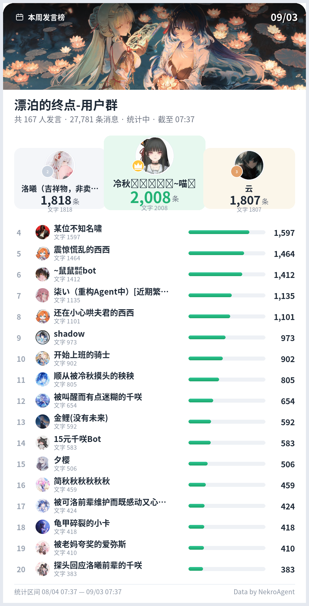
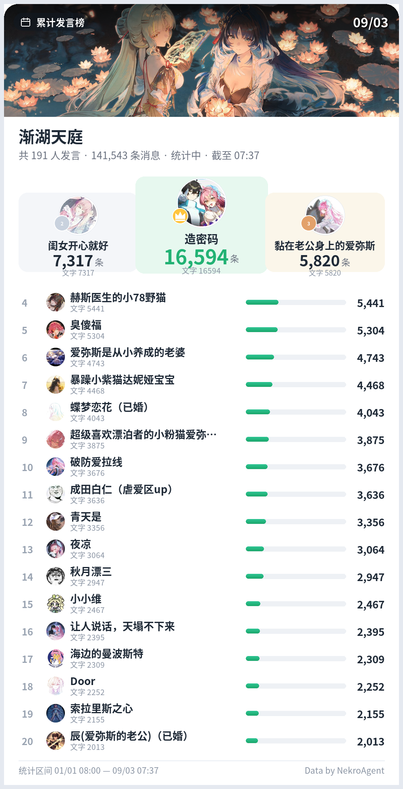

# nekro_plugin_msg_rank 群发言排行榜

NekroAgent 插件：统计群成员发言条数，渲染为「每日发言榜」风格的可视化排行榜图片发送到群聊。

- `/发言榜` 指令：默认统计**今日**（自然日），可选本周 / 本月
- Agent 工具：Bot 可主动调用，查询今日 / 本周 / 本月排行
- 前三名领奖台 + 明细列表（文字 / 图片 / 其他 分项统计）
- 头像强制拉取真实 QQ 头像，拉取失败自动回退字母头像
- 顶部背景图从 `banners/` 目录**随机抽取**（预置 6 张鸣潮官方横版壁纸，可自行增删）
- 统计口径与榜单人数可在 NekroAgent 插件管理 WebUI 中配置

## 预览





## 安装

1. 将本目录放入 NekroAgent 的 `plugins/packages/nekro_plugin_msg_rank/`
2. 放置中文字体到插件 `fonts/` 目录（仓库未内置大体积字体文件）：
   - 需要 `NotoSansCJK-Regular.ttc` 与 `NotoSansCJK-Bold.ttc`
   - 可从 [Google Noto CJK](https://github.com/notofonts/noto-cjk/releases) 下载，或直接从 NekroAgent 容器内复制：`/usr/share/fonts/opentype/noto/`
3. 重启 NekroAgent 容器（`docker restart nekro_agent`）
4. 日志出现 `插件加载成功: "群发言排行榜"` 即安装成功

依赖说明：插件运行需要 `Pillow` 与 `httpx`。缺失时插件会在首次调用时尝试通过 NekroAgent 的动态包机制自动安装；建议提前在容器虚拟环境内安装好（注意装进 `/app/.venv`，不是系统 Python）。

## 使用

### 指令（群聊内）

```
/发言榜            # 今日（自然日，从今天 0 点到现在）
/发言榜 本周        # 本自然周（周一 0 点起）
/发言榜 本月        # 本自然月（1 号 0 点起）
```

别名：`/发言排行`、`/排行榜`。

### Agent 工具（Bot 主动调用）

| 工具 | 说明 |
|---|---|
| 查询群发言排行榜（图片） | 统计并渲染排行榜图片发送到群聊，`scope` 参数可选 today / week / month |
| 查询群发言排行榜（文本） | 同样数据以文本返回，不发图片 |

## 配置（插件管理 WebUI）

| 配置项 | 默认 | 说明 |
|---|---|---|
| 榜单人数 TOP_N | 20 | 排行榜展示的总人数（含前三名领奖台），3~60 |
| 排除机器人与系统消息 | 开启 | 排除 `sender_id` 为 `-1` 或空的 Bot / 系统消息 |

## 自定义背景图

将横版图片放入插件 `banners/` 目录，命名为 `banner_N.jpg`（N 为序号）即可，每次生成随机抽取，无需重启。当前预置的 6 张为鸣潮（Wuthering Waves）官方横版壁纸，仅供个人娱乐使用，版权归 库洛游戏（Kuro Games） 所有。

## 数据口径

- 基于 NekroAgent 数据库 `chat_message` 表，按群（`chat_key`）统计
- 排除已撤回消息；排除 Bot 自身与系统消息（可配置）
- 「文字 / 图片 / 其他」按消息内 CQ 码分类：含 `CQ:image` 计为图片，含 `CQ:forward / video / record / file` 计为其他，其余为文字

## 更新日志

见 [CHANGELOG.md](CHANGELOG.md)。

## 作者

[Akiyo-dayo](https://github.com/Akiyo-dayo)
